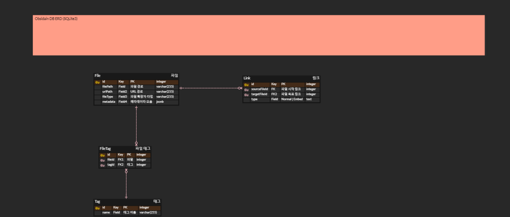

# 프로젝트 소개

obsidian의 그래프를 위해 파일(Node), 파일간 링크(Link)의 관계를 저장하는 블로그용 간이 DB

## 특징

- obsidian을 위한 간이 db 프로젝트 (Sqlite3만 지원)
- obsidian-short 알고리즘 기반으로 적용되어 있음 (추후에 상대 경로, 절대 경로 지원 선택 할 수 있도록 인터페이스 제공 고려중)
- [portalJS](https://www.npmjs.com/package/@portaljs/remark-wiki-link) 라이브러리에 의존해서 링크 추출 

## 스키마

[Obsidian-db ERD cloud](https://www.erdcloud.com/d/ndNdpprfxSYydGitb)



## 사용 방법

### ObsidianDB 생성

```ts
import ObsidianDb from "obsidian-db";

const obdb = ObsidianDb.builder()
    .withKnexConfig({
        client: "sqlite3",
        connection: {
            filename: "./obsidian.db",
        },
        useNullAsDefault: true,
    })
    .withBuildAstOptions({
        // remarkPlugins: [],
        permalinks: ["a", "b"],
    })
    // .addLinkExtractor(linkExtractor)
    .build();

export default obdb;
```

초기화 스크립트

```ts
import obdb from "obsidian-db";

obdb.createTables();
obdb.indexDirectory("content");

```

- ObsidianDbBuilder는 ObsidianDB 인스턴스를 생성하는 빌더 클래스이다.
- "content"에는 본인이 적용하고자 폴더의 `상대 경로`를 입력한다.
- withKnexConfig는 kndex 설정으로 왠만하면 그대로 사용한다.
- withBuildAstOptions는 remark-wiki-link 파싱 옵션으로 permalinks를 잘 설정해준다.(permalinks는 obsidian-short-path의 알고리즘에 이용될 경로 리스트이다.)
- 기본적으로 적용되는 extractor 이외에 추가로 적용하고 싶은 extractor가 있다면 addLinkExtractor를 이용하여 추가한다.

### 사용자 정의 extractor

```ts
class WikiLinkExtractor extends AbstractLinkExtractor implements LinkExtractor {
    constructor() {
        super("wikiLink");
    }

    protected customExtractLogic(node: any): string {
        const data = node.data;
        if (data.isEmbed === false && data.exists === true) {
            return data.permalink;
        }
        return "";
    }
}

export default WikiLinkExtractor;
```

- constructor에는 추출할 type을 정한다. ast는 mdast 기준이다.
- customExtractLogic은 ast에서 추출할 데이터를 string 타입으로 리턴한다.
- 위의 과정을 모두 따르면 추출 로직을 재귀적으로 탐색하며 추출한다.

### 쿼리

ObsidianDB는 4가지 쿼리를 제공한다.
- findFiles
- findUrlLinksAll
- findUrlLinksForward
- findUrlLinksBackward
- db()

#### findFiles

findFiles 검색 옵션은 다음과 같은 인터페이스로 제공한다.

```ts
interface SelectFileCondition {
    where?: {
        id?: number;
        filePath?: string;
        urlPath?: string;
        fileType?: string;
        title?: string;
        tagNames?: string[];
    };
    limit?: number;
}
```

where의 경우 모두 and 조건으로 연결된다.

#### findUrlLinksAll

모든 Url 링크를 리턴한다. 

#### findUrlLinksForward

특정 파일에서 연결된 링크를 리턴한다.

#### findUrlLinksBackward

특정 파일로 들어오는 링크를 리턴한다.

#### db()

내부의 knexDb 인스턴스를 리턴한다. 이를 활용해서 db에 직접 쿼리를 작성할 수 있다.(Knex)

### permalink와 filePath 유틸 클래스 제공
```ts
    findFilePathsAll(rootDir: string, extension: string[] = []);
    findPermalinksAll(rootDir: string, extension: string[] = []);
    toPermalink(filePath: string, basePath: string);
    fixWindowPath(filePath: string);
```

## 변경 사항

- 0.1.0:
    - markdown 파일의 도메인을 구성할 스키마 구현(파일, 링크, 태그, 파일태그)
    - 쿼리 함수 구현(파일 쿼리, 태그 쿼리, 링크 쿼리) 
- 0.2.0:
    - markdownDB 인스턴스 초기화 및 쿼리 메서드 추가
- 0.2.1:
    - module import 문제 수정 
- 0.2.3:
    - gray matter import 오류 수정
- 0.2.4:
    - 기존 구조 개선(obsidianDB, read, parser)
    - link 오류 수정
- 0.2.5:
    - 링크 연결 오류시 오류 메시지 출력
- 0.2.6:
    - 파일 path 컬럼 유니크 설정
    - 링크 잘못된 오류 메시지 출력 수정
    - 링크 urlPath에 basePath가 나오지 않도록 수정
- 0.2.7:
    - Extractor 객체 분리 및 구조 개선
    - Wiki link Extractor, MdLinkExtractor 추가
- 0.3.0:
    - Link Query 수정
    - knexDb 인터페이스 제공
    - abstract link extractor 와 인터페이스 제공
- 0.4.0:
    -  filePath와 permalink 유틸 인터페이스 제공
    -  findPathsAll과 findPermalinksAll 인자에 extension 에 따른 필터 제공
- 0.4.1:
    - db() 메서드 오류 수정
- 0.4.2:
    - urlPath에 윈도우 path가 나오지 않도록 수정
- 0.5.0:
    - file 단일 쿼리 추가
    - 양방향 negibor 링크 쿼리 추가
    - init() 매번 초기화 문제 개선
- 0.5.2:
    - urlPath nullable하게 스키마 변경 및 입력 가능
    - permalink가 url 로직에 영향 받도록 수정(index인 경우 ""로 변경됨)
- 0.5.3:
    - urlPath가 매칭이 안되 link가 생성되지 않는 부분 수정
- 0.6.1:
    - tag 중복 여부 삭제